<a href="https://github.com/minhduoc-tran">
  <picture>
    <source media="(prefers-color-scheme: dark)" srcset="./assets/hero-dark.svg" />
    
  </picture>
</a>

  <a href="https://table-cn.vercel.app">tablecn</a> &nbsp;·&nbsp;
  <a href="https://www.npmjs.com/search?q=%40querycn">npm</a> &nbsp;·&nbsp;
  <a href="https://www.facebook.com/profile.php?id=100027522219067">Facebook</a>

 

<a href="https://github.com/minhduoc-tran/tablecn">
  <picture>
    <source media="(prefers-color-scheme: dark)" srcset="./assets/project-tablecn-dark.svg" />
    
  </picture>
</a>

  <a href="https://table-cn.vercel.app">Live demo</a> &nbsp;·&nbsp;
  <a href="https://table-cn.vercel.app/docs">Docs</a> &nbsp;·&nbsp;
  <a href="https://github.com/minhduoc-tran/tablecn">Source</a>

| Package | Version | What it does |
| --- | --- | --- |
| [`@querycn/filter-core`](https://www.npmjs.com/package/@querycn/filter-core) |  | Filter rules, URL codec and backend serializers, no dependencies |
| [`@querycn/filter-react`](https://www.npmjs.com/package/@querycn/filter-react) |  | Headless React provider, hooks and URL adapters |
| [`@querycn/filter-next`](https://www.npmjs.com/package/@querycn/filter-next) |  | Next.js App Router adapter and server-side parser |
| [`@querycn/table-react`](https://www.npmjs.com/package/@querycn/table-react) |  | Headless data table on TanStack Table with URL-synced state |

 

<picture>
  <source media="(prefers-color-scheme: dark)" srcset="./assets/stack-dark.svg" />
  
</picture>

  

  <picture>
    <source media="(prefers-color-scheme: dark)" srcset="https://github-readme-stats.vercel.app/api?username=minhduoc-tran&show_icons=true&include_all_commits=true&hide_rank=false&border_radius=14&card_width=420&bg_color=09090b&title_color=fafafa&text_color=a1a1aa&icon_color=60a5fa&ring_color=60a5fa&border_color=27272a" />
    
  </picture>
  <picture>
    <source media="(prefers-color-scheme: dark)" srcset="https://streak-stats.demolab.com?user=minhduoc-tran&border_radius=14&card_width=420&background=09090b&border=27272a&stroke=27272a&ring=60a5fa&fire=60a5fa&currStreakNum=fafafa&sideNums=fafafa&currStreakLabel=60a5fa&sideLabels=a1a1aa&dates=71717a" />
    
  </picture>

